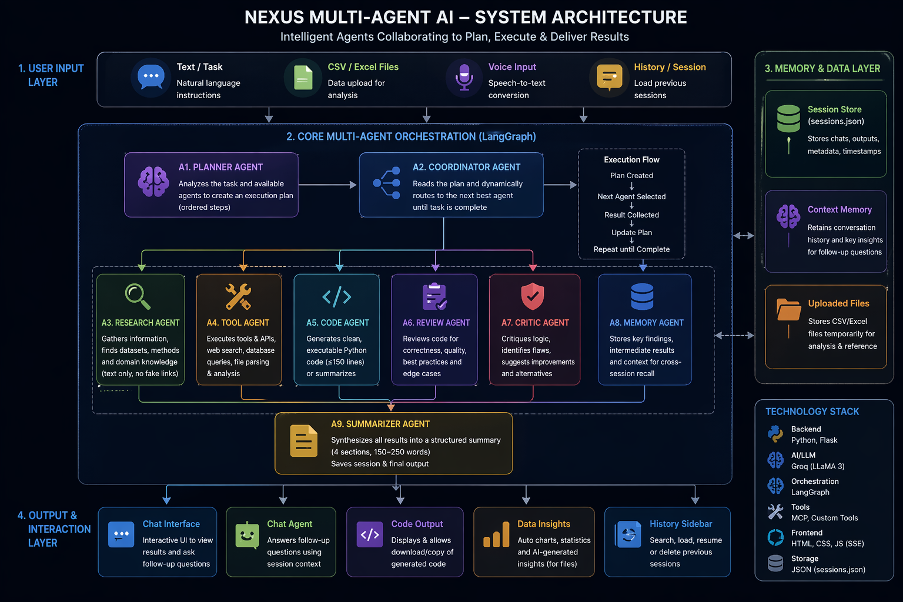

# 🤖 Nexus Multi-Agent AI

A fully autonomous, multi-agent AI system built with **LangGraph**, **Groq (LLaMA 3)**, and **Flask**. Agents collaborate in a dynamic pipeline to plan, research, code, review, and summarize — with persistent chat history, CSV/Excel file analysis, and context-aware follow-up conversations.

---
## 🎯 Why This Project Matters

This project demonstrates **AI Engineering beyond model training**, focusing on:

- **Multi-Agent Orchestration** using LangGraph  
- **LLM System Design** (planning, routing, reasoning pipelines)  
- **MCP-style workflows** with file-based contextual reasoning  
- **Stateful AI systems** with persistent memory and session tracking  
- **Production-oriented backend design** using Flask + SSE streaming  

It reflects how modern AI systems are built in production — combining LLMs, tools, and backend infrastructure.

## ✨ Features

| Feature | Description |
|---|---|
| 🧠 **Multi-Agent Pipeline** | 8 specialized agents collaborate via LangGraph |
| 📊 **CSV / Excel Analysis** | Upload files → auto stats, charts, and AI insights |
| 💬 **Context-Aware Chat** | Ask follow-up questions after any run or file upload |
| 🕓 **Session History** | Every run is saved, searchable, and resumable |
| 🔒 **No Fake Links** | Research agent uses text-only descriptions, zero fabricated URLs |
| 🎙️ **Voice Input** | Browser speech recognition for hands-free task entry |
| 📥 **Code Download** | Copy or download generated Python code directly |

---

## 🏗️ Architecture


## 🤖 Agents

| Agent | Role |
|---|---|
| **Planner** | Reads the task + available agents, produces an ordered execution plan |
| **Coordinator** | Dynamically routes to each agent in the plan (no hardcoded sequences) |
| **Research** | Finds relevant facts, datasets, and approaches — text only, no fake links |
| **Tool** | Executes MCP tools (web search, DB queries); loads & analyses uploaded files |
| **Code** | Generates clean, executable Python code (≤150 lines; summarizes if longer) |
| **Review** | Code quality review — correctness, style, edge cases |
| **Critic** | Identifies logical flaws and suggests improvements |
| **Memory** | Stores key findings for cross-session recall |
| **Summarizer** | Produces a crisp 150–250 word Markdown summary in 4 fixed sections |
| **Chat Agent** | Answers follow-up questions using retained session context (no re-run) |

---

## ⚙️ Key Engineering Highlights

- Dynamic agent orchestration (no hardcoded workflows)
- Streaming responses using Server-Sent Events (SSE)
- Guardrails for hallucination (no fake links enforcement)
- Code generation with length constraints and validation
- Modular agent registry system for extensibility

## 📁 Project Structure

```
multi_agent/
├── app.py                  # Flask app — routes, SSE streaming, session mgmt
├── session_store.py        # JSON-backed session persistence
├── requirements.txt        # Python dependencies
├── sessions.json           # Auto-created — stores all chat sessions
│
├── agents/
│   ├── state.py            # AgentState TypedDict
│   ├── registry.py         # @register_agent decorator
│   ├── json_utils.py       # LLM JSON retry + repair utilities
│   ├── planner_agent.py    # Task planning
│   ├── coordinator_agent.py# Dynamic routing
│   ├── research_agent.py   # Research (no URLs)
│   ├── tool_agent.py       # MCP tools + CSV/Excel analysis
│   ├── code_agent.py       # Code generation
│   ├── review_agent.py     # Code review
│   ├── critic_agent.py     # Logic critique
│   ├── memory_agent.py     # Memory storage
│   ├── summarizer_agent.py # Final summary
│   └── chat_agent.py       # Context-aware follow-up chat
│
├── mcp_tools/
│   └── tools.py            # MCP tool registry
│
└── templates/
    └── index.html          # Full UI (sidebar, chat, file upload)
```

---

## 🚀 Setup & Run

### 1. Clone & enter the project
```bash
git clone <your-repo-url>
cd multi_agent
```

### 2. Create and activate a virtual environment
```bash
python -m venv venv

# Windows
venv\Scripts\activate

# macOS / Linux
source venv/bin/activate
```

### 3. Install dependencies
```bash
pip install -r requirements.txt
pip install pandas matplotlib openpyxl  # for file analysis
```

### 4. Configure environment variables
Create a `.env` file in the project root:
```env
GROQ_API_KEY=your_groq_api_key_here
```

Get your free API key at **console.groq.com**

### 5. Run the server
```bash
python multi_agent/app.py
```

Open your browser at: **http://127.0.0.1:5000**

---

## 🧪 Usage

### Text Task
1. Type your task in the text area
2. Click **Initialize Agents**
3. Watch each agent run in real-time (status chips + expandable output cards)
4. Read the **Final Summary** (4 sections, ~200 words)
5. Use the **Chat Panel** to ask follow-up questions

### File Upload (CSV / Excel)
1. Drag & drop or click the upload zone
2. Analysis runs automatically:
   - Shape, columns, missing values, numeric stats
   - Distribution charts (dark-themed)
   - AI-generated insights (3–5 bullets)
3. **Chat panel opens immediately** — ask questions about your data
4. Optionally type a task + click **Initialize Agents** to run the full pipeline with file context injected

### Chat History (Sidebar)
- Click the **☰** menu icon to open the sidebar
- All sessions are listed with timestamp and message count
- Click any session to **restore** it (output + chat)
- Use the **search bar** to filter sessions
- Click 🗑️ to delete a session

---

## 🔌 API Endpoints

| Method | Endpoint | Description |
|---|---|---|
| `GET` | `/` | Serve the UI |
| `GET` | `/agents` | List all registered agents |
| `POST` | `/run` | Run the full agent pipeline (SSE stream) |
| `POST` | `/analyze-file` | Analyze a CSV/Excel file, return stats + chart + insights |
| `POST` | `/chat` | Context-aware follow-up chat using session context |
| `GET` | `/sessions` | List all saved sessions |
| `GET` | `/sessions/<id>` | Load a specific session |
| `DELETE` | `/sessions/<id>` | Delete a session |

### `/run` — Request body
```json
{ "task": "Build a Python web scraper for news headlines" }
```
Or send as `multipart/form-data` with `task` + `file` fields.

### `/chat` — Request body
```json
{
  "session_id": "a1b2c3d4",
  "message": "What was the main algorithm used?"
}
```

### `/analyze-file` — Response
```json
{
  "filename": "sales_data.csv",
  "summary": "**Shape:** 1200 rows × 8 columns\n...",
  "chart_b64": "<base64 PNG>",
  "insights": "- Revenue peaks in Q4\n- 3.2% missing values in 'discount'",
  "session_id": "f3e1a2b4"
}
```


---

## 📦 Dependencies

```
flask
langgraph
langchain-groq
langchain-community
langchain-mcp-adapters
python-dotenv
pandas
matplotlib
openpyxl
requests
```

---

## 🔑 Environment Variables

| Variable | Required | Description |
|---|---|---|
| `GROQ_API_KEY` | ✅ Yes | Groq API key for LLaMA 3 inference |

---

## 📄 License

MIT License — free to use, modify, and distribute.

---

*Built with LangGraph · Groq LLaMA 3 · Flask · pandas · matplotlib*
